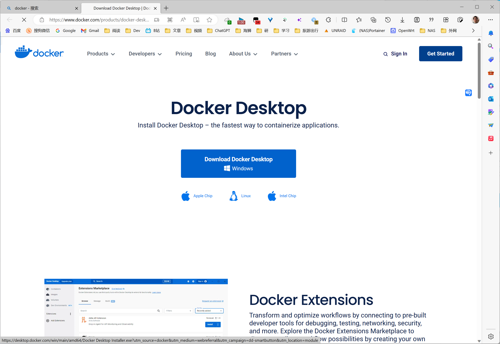

# YSU 校园网 视频流程

# 介绍校园网情况

## 校园网

免费流量
本科 10G
研究生 20G

## 运营商网络

## 覆盖情况

宿舍区，教学楼，自习室，图书馆 WIFI 全覆盖

教学楼只能使用校园网！

# 介绍验证界面

# 介绍网络拓扑结构

# 介绍 YsuAuth

Docker Hub
https://hub.docker.com/r/a645162/ysuauth
https://github.com/YsKoala/ysuauth

## 部署方法

### 已经安装 Docker

#### 直接安装

#### 换源

中科大源
https://mirrors.ustc.edu.cn/help/dockerhub.html

### Windows 下安装 Docker-Desktop

https://www.docker.com/products/docker-desktop/

### Linux 下安装 Docker 全家桶

不进行详细的描述，
因为，毕竟您已经使用Linux系统了，您应该有能力自己解决！

仅仅给出相关的教程链接！

安装 Docker Desktop
https://docs.docker.com/desktop/install/linux-install/

通过清华源部署全家桶
https://mirrors.tuna.tsinghua.edu.cn/help/docker-ce/

换源为中科大源
https://mirrors.ustc.edu.cn/help/docker-ce.html

### 命令行

docker-compose up -d

### Portainer-CE

首先安装 Portainer
https://docs.portainer.io/start/install-ce/server/docker

