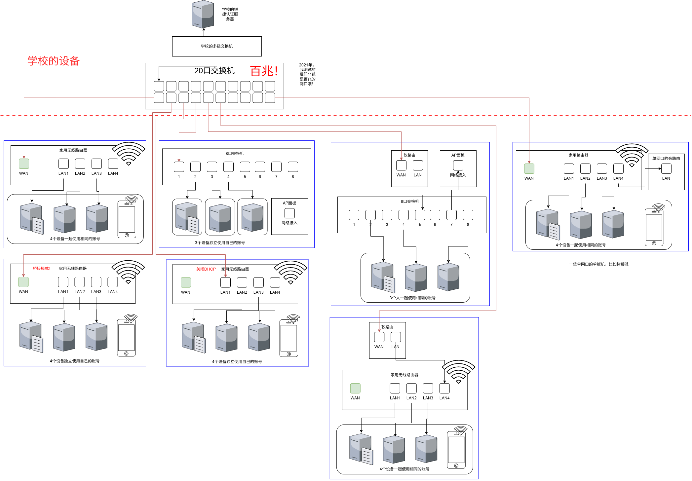
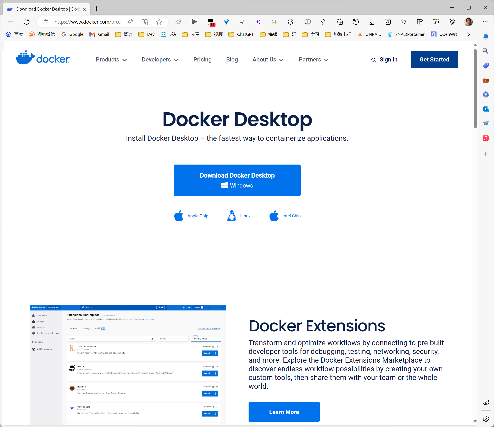

# YSU 校园网 视频流程

# 介绍校园网情况

https://yit.ysu.edu.cn/info/1032/1131.htm

## 校园网

每月免费流量
本科/研究生 20G

打游戏延迟极低！
下载速度巨快！

## 运营商网络

去西区大食堂1楼办理。

- 移动
- 联通
- 电信

## 覆盖情况

宿舍区，教学楼，自习室，图书馆 WIFI 全覆盖。

教学楼只能使用校园网！但是图书馆以及里仁的图文可以用运营商网络。

# 介绍验证界面


登录页面就是这样，输入学号以及密码就可以了。
如果提示设备数量超过上限，那说明你有一台设备没有退出登录，进入自助服务操作一下即可。

一定一定要选择服务！

选择完服务点击登录即可！


# 介绍自助服务界面


# 介绍网络拓扑结构



## 路由器选购

建议上 WIFI6 路由器，体验最好。

最次最次，得支持 5GHz ！！！

不要贪便宜(用送的)，2.4GHz的路由器，谁用谁知道。

## 路由器设置

建议关掉双频合一，就是2.4GHz一个热点，5GHz一个热点， 然后直接连5GHz。

没别的，主要是2.4GHz的东西太多了，你的网速肯定不行！

路由器的桥接模式


关闭路由器DHCP


# 介绍 YSU-NetLogin-Script

仓库地址：
https://github.com/BeingGod/YSU-NetLogin-Script

## 准备工作

下载 Python 3

https://www.python.org/downloads/

用 pip 安装依赖库
```bash
pip install urllib3
```

## 使用方法

登录

```bash
# 服务器提供商: 0.校园网(默认) 1.中国移动 2.中国联通 3.中国电信
python netlogin.py {学号} {密码} {服务提供商编号}
```

退出登录

```bash
python main.py logout
```

## 高阶操作

1.制作bat脚本/sh脚本

2.Windows 计划任务/Linux crontab 定时运行

3.修改它的代码
login函数的code参数他的默认值为空，
其实，当你在认证页面密码多次输入错误会让你输入验证码，但是其实用这个脚本不提交验证码也可以，所以留空即可。

# 介绍 YsuAuth

基于 YSU-NetLogin-Script 项目抓到的API重写核心代码并添加一些实用功能的一个版本，

新功能：
- 实时监测网络是否断开
- 重连后自动推送到钉钉
- 定时工作功能
- 单账号多服务(按顺序尝试)
- 多账号(按顺序)

Docker Hub
https://hub.docker.com/r/a645162/ysuauth

Github 仓库
https://github.com/a645162/ysuauth

Gitee 仓库(定期与Github仓库同步)
https://gitee.com/a645162/ysuauth

## 部署方法

### Windows 下安装 Docker-Desktop

https://www.docker.com/products/docker-desktop/


### Linux 下安装 Docker 全家桶

不进行详细的描述，
因为，毕竟您已经使用Linux系统了，您应该有能力自己解决！

仅仅给出相关的教程链接！

安装 Docker Desktop
https://docs.docker.com/desktop/install/linux-install/

通过清华源部署全家桶
https://mirrors.tuna.tsinghua.edu.cn/help/docker-ce/

换源为中科大源
https://mirrors.ustc.edu.cn/help/docker-ce.html

### 已经安装 Docker

#### 换源

中科大源
https://mirrors.ustc.edu.cn/help/dockerhub.html

#### 安装 docker-compose

https://github.com/docker/compose

### 部署容器

#### docker-compose

sudo docker-compose up -d

#### Portainer-CE

首先安装 Portainer
https://docs.portainer.io/start/install-ce/server/docker

在 Portainer 中部署。
