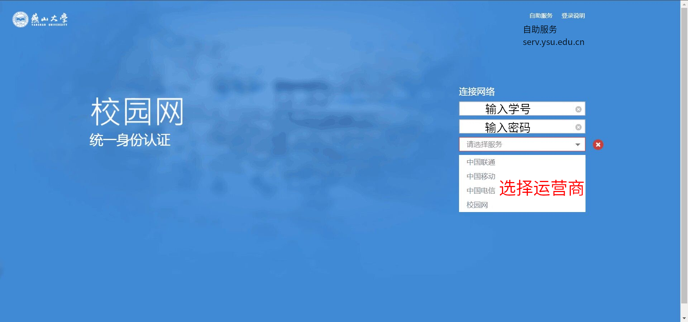
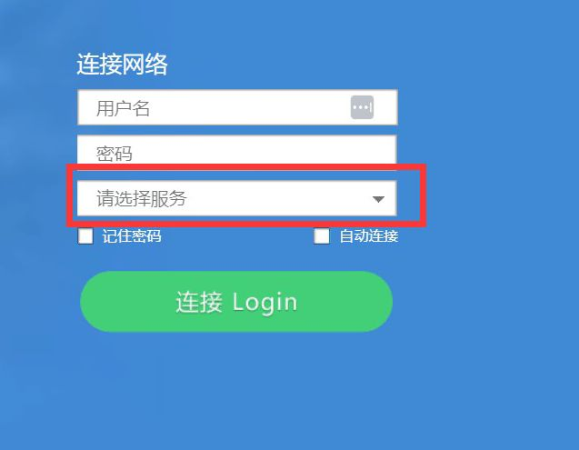

# YSU 校园网 视频流程

# 介绍校园网情况

https://yit.ysu.edu.cn/info/1032/1131.htm

## 校园网

每月免费流量
本科/研究生 20G

打游戏延迟极低！
下载速度巨快！

## 运营商网络

## 覆盖情况

宿舍区，教学楼，自习室，图书馆 WIFI 全覆盖。

教学楼只能使用校园网！

# 介绍验证界面



登录页面就是这样，输入学号以及密码就可以了。
如果提示设备数量超过上限，那说明你有一台设备没有退出登录，进入自助服务操作一下即可。

一定一定要选择服务！

选择完服务点击登录即可！



# 介绍自助服务界面


# 介绍网络拓扑结构


# 介绍 YSU-NetLogin-Script

仓库地址：
https://github.com/BeingGod/YSU-NetLogin-Script

准备工作
```bash
pip install urllib3
```

登录
```bash
# 服务器提供商: 0.校园网 1.中国移动 2.中国联通 3.中国电信
python netlogin.py {学号} {密码} {服务提供商编号(默认0.校园网)}
```

退出登录
```bash
python main.py logout
```

高阶操作
修改它的代码
login函数的code参数他的默认值为空，其实，当你

# 介绍 YsuAuth

Docker Hub
https://hub.docker.com/r/a645162/ysuauth
https://github.com/a645162/ysuauth

## 部署方法

### 已经安装 Docker

#### 直接安装

#### 换源

中科大源
https://mirrors.ustc.edu.cn/help/dockerhub.html

### Windows 下安装 Docker-Desktop

https://www.docker.com/products/docker-desktop/


### Linux 下安装 Docker 全家桶

不进行详细的描述，
因为，毕竟您已经使用Linux系统了，您应该有能力自己解决！

仅仅给出相关的教程链接！

安装 Docker Desktop
https://docs.docker.com/desktop/install/linux-install/

通过清华源部署全家桶
https://mirrors.tuna.tsinghua.edu.cn/help/docker-ce/

换源为中科大源
https://mirrors.ustc.edu.cn/help/docker-ce.html

### 命令行

sudo docker-compose --compatibility up -d

### Portainer-CE

首先安装 Portainer
https://docs.portainer.io/start/install-ce/server/docker


